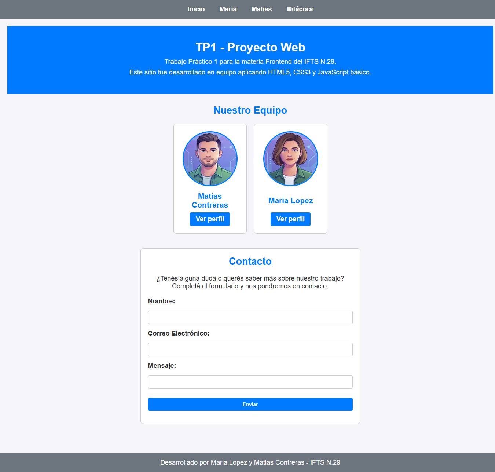
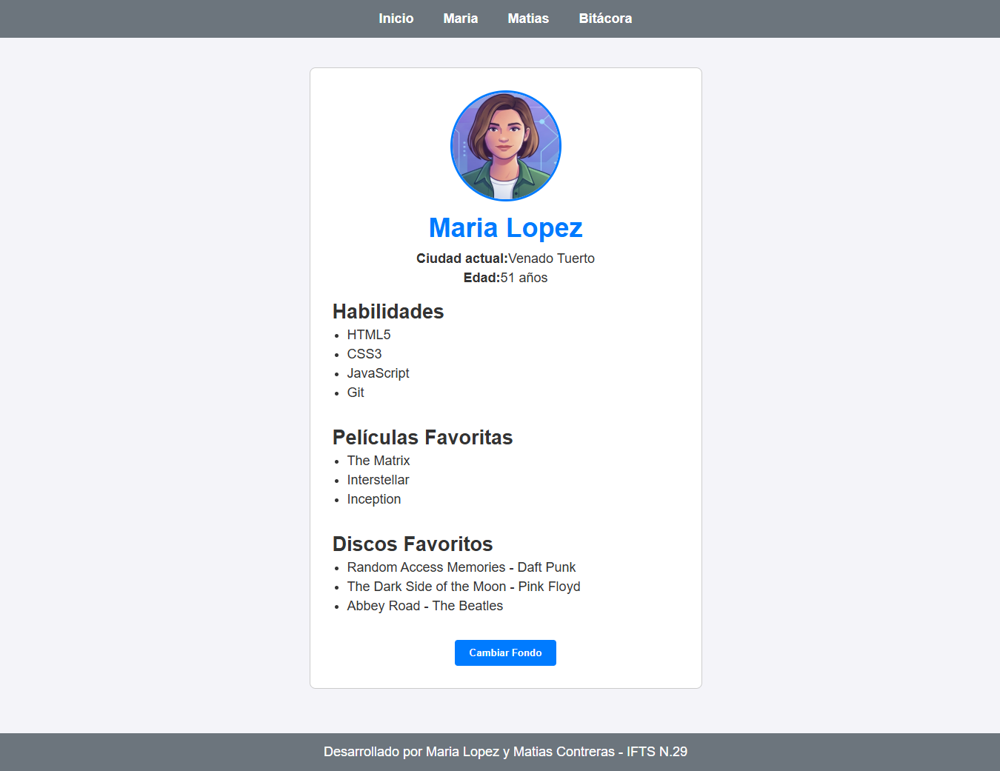
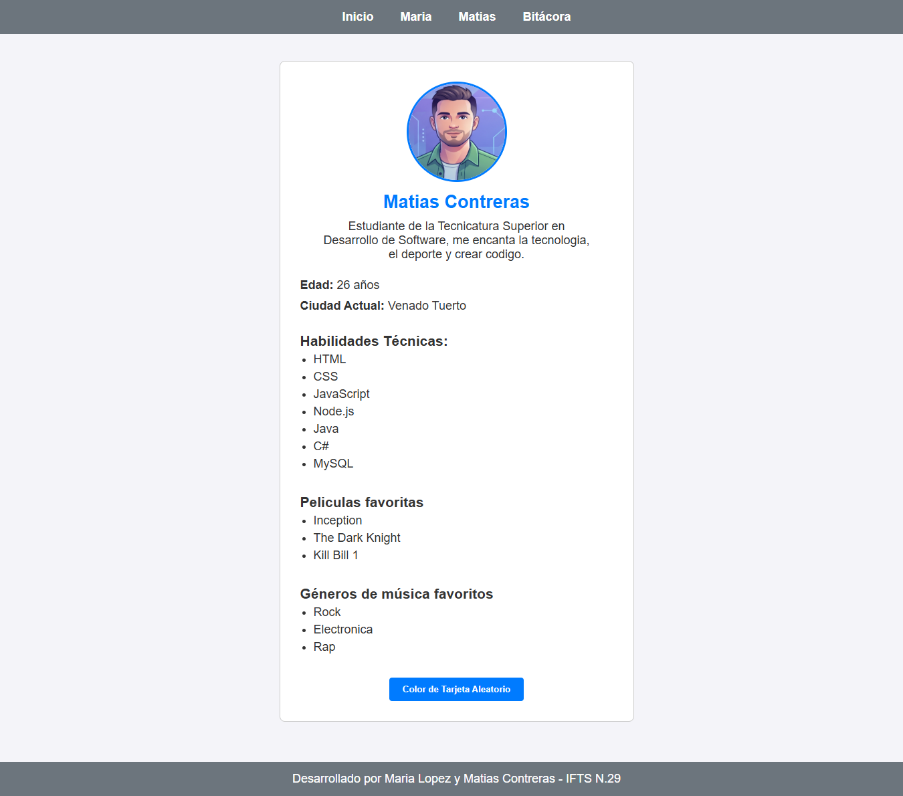
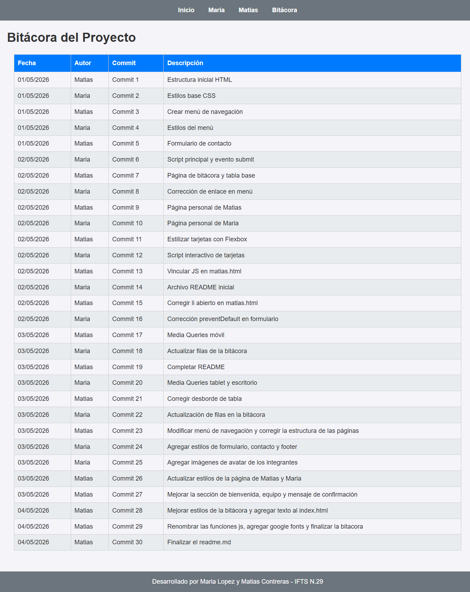
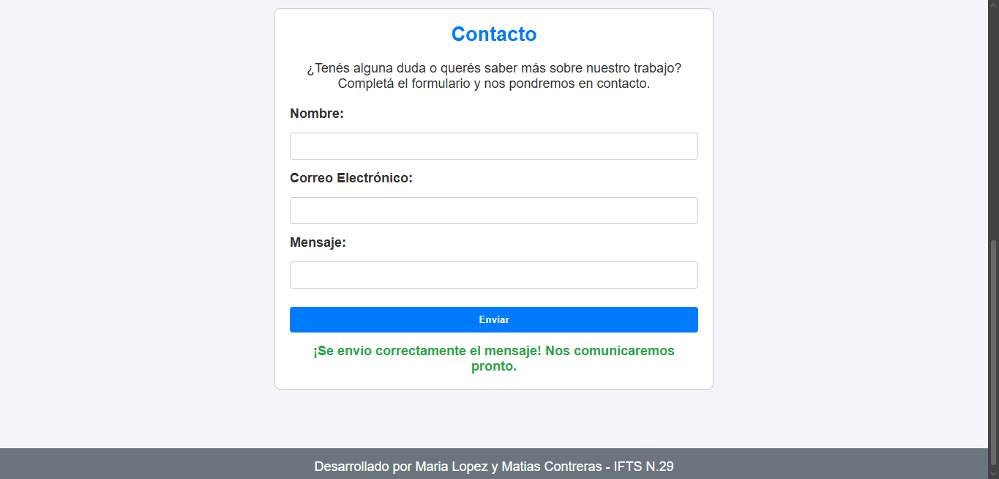
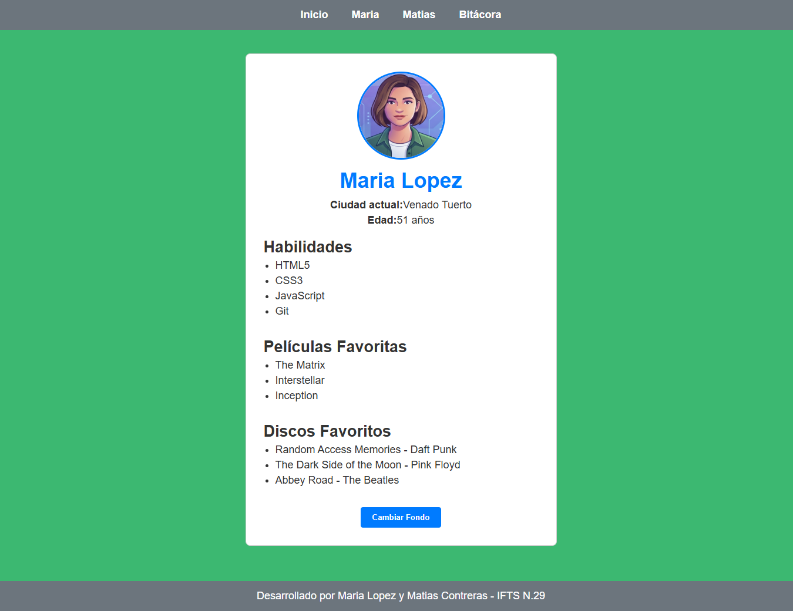
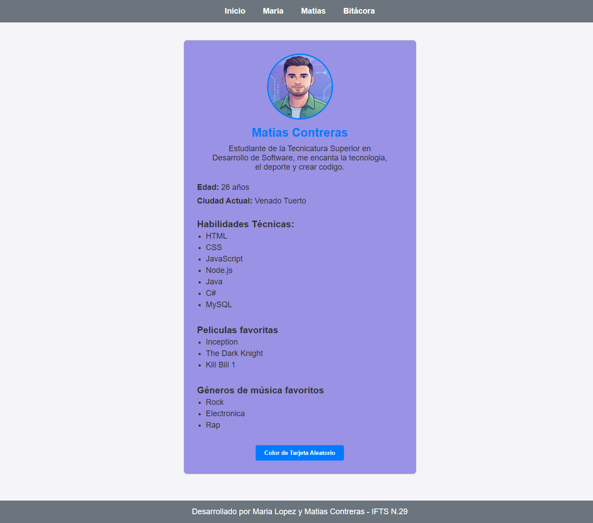

# TP1 Proyecto Web

### Enlace al deploy en Vercel: https://tp1-proyecto-web-seven.vercel.app

## Descripción
Trabajo Práctico 1 para la materia Frontend del IFTS N.29. Es un sitio web desarrollado en equipo que presenta a los integrantes del grupo y documenta el proceso de desarrollo. Se aplicó HTML5, CSS3 con diseño adaptable y JavaScript básico para interactividad.

El proyecto fue desarrollado en equipo con un entorno de trabajo colaborativo utilizando Git y GitHub.

## Integrantes del Equipo
* Maria Lopez - https://github.com/Marialopez2020
* Matias Contreras - https://github.com/Matihp

## Tecnologías Utilizadas
* **HTML5**: Uso de etiquetas semánticas (`header`, `nav`, `main`, `section`, `article`, `footer`).
* **CSS3**: Maquetación con Flexbox, modelo de cajas y diseño adaptable con Media Queries.
* **JavaScript**: Manipulación del DOM con `getElementById`, `addEventListener` y `textContent`.
* **Google Fonts**: Tipografías personalizadas para mejorar la estética del sitio.
* **Git/GitHub**: Control de versiones y trabajo colaborativo.
* **Vercel**: Despliegue del proyecto.

## Estructura de Archivos
* `/`: index.html, maria.html, matias.html, bitacora.html y README.md.
* `/css`: estilos.css.
* `/js`: principal.js y tarjetas.js.
* `/img`: imágenes y avatares de los integrantes.
* `/capturas`: capturas de pantalla del proyecto.

## Guía de Estilos
* **Colores**: Fondo `#f4f4f9`, Texto `#333333`, Primario `#007bff`, Secundario `#6c757d`.
* **Tipografía**: Google Fonts (Roboto) - [https://fonts.googleapis.com/css2?family=Roboto:wght@400;700&display=swap]
* **Breakpoints**: Móvil `400px`, Tablet `900px`, Escritorio `1200px`.
* **Iconografía**: Se utilizaron avatares generados por IA.

## Capturas de Pantalla
En esta sección se presentan las vistas principales del sitio en su versión de escritorio:

### Vistas Generales

*Pagina de Inicio con banner de bienvenida, sección de equipo y formulario de contacto.*

*Perfil personal de Maria Lopez con sus datos y tecnologías.*

*Perfil personal de Matias Contreras con sus datos y tecnologías.*

*Bitácora del proyecto donde se detalla todo lo realizado en el trabajo práctico.*

### Detalles de Diseño (Hover)

*Detalle del menú de navegación mostrando el cambio de color al pasar el mouse por los enlaces.*

*Detalle del botón "Ver perfil" en las tarjetas del equipo mostrando el cambio de color al pasar el mouse.*

## Funciones JavaScript
A continuación se muestran las funcionalidades dinámicas implementadas con JS:

### Portada (`principal.js`) - Función `gestionarEnvioFormulario`
Función que escucha el evento `submit` del formulario de contacto. Al enviar evita la recarga de la página con `e.preventDefault()`, limpia el formulario y muestra un mensaje de confirmación visible en la página.

*Mensaje de confirmación en verde luego de enviar el formulario con los datos ingresados.*

### Tarjeta de Maria (`tarjetas.js`) - Función `cambiarFondoPagina`
Función asociada al botón `#btn-maria` que al activarse mediante un evento de clic genera un color hexadecimal aleatorio y lo aplica al estilo de fondo (`backgroundColor`) de todo el cuerpo de la página (`document.body`).

*La página de Maria con un color de fondo aleatorio.*

### Tarjeta de Matias (`tarjetas.js`) - Función `cambiarFondoTarjeta`
Función vinculada al botón `#btn-matias` que utiliza un evento de clic para aplicar un color hexadecimal generado aleatoriamente al fondo específico del contenedor de la tarjeta (`.tarjeta`).

*La tarjeta de Matias con un color de fondo diferente.*

## Uso de Inteligencia Artificial
* **Herramientas**: La IA Gemini.
* **Uso en Código**: Se consultó para solucionar algunos errores de código, implementar Media Queries y dar formato al README.md.
* **Imágenes**: Avatares generados con IA para las páginas de los integrantes del equipo.
